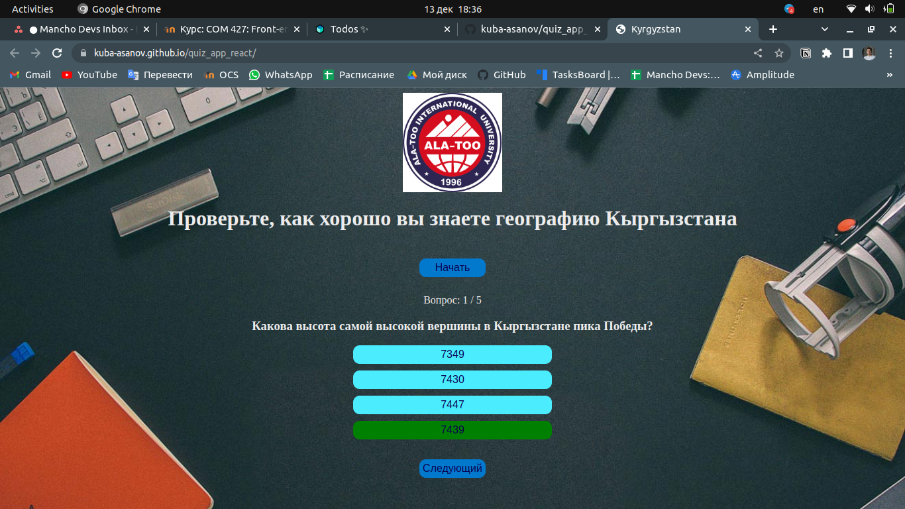
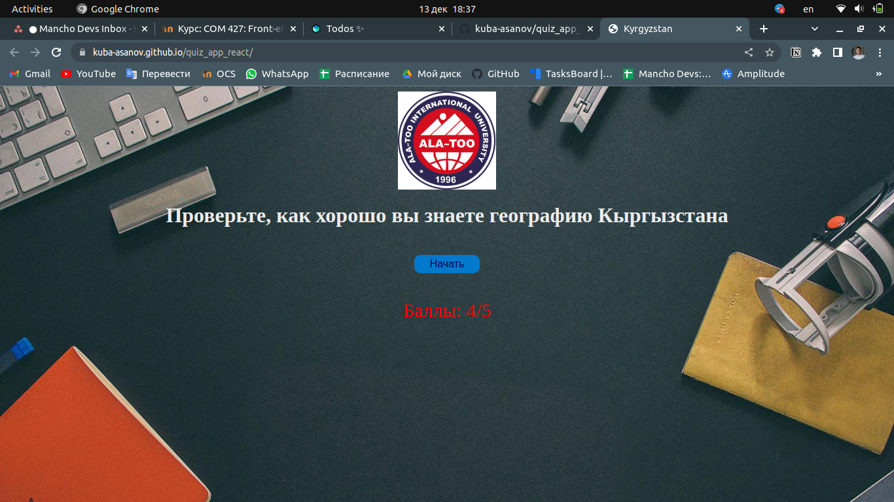

# Challenging educational application
### This application teaches school students the basics of history. 
Platform in Russian language and with gamification logic. 

### Here, students can take a test and immediately find out whether their answers are correct or incorrect, and based on this, receive a certain number of points.
They can take the test as long as they want.

## Some screenshots:

# Getting Started with App

This project was bootstrapped with [Create React App](https://github.com/facebook/create-react-app).

In the project directory, you can run:

### `npm start`

Runs the app in the development mode.\
Open [http://localhost:3000](http://localhost:3000) to view it in the browser.

The page will reload if you make edits.\
You will also see any lint errors in the console.